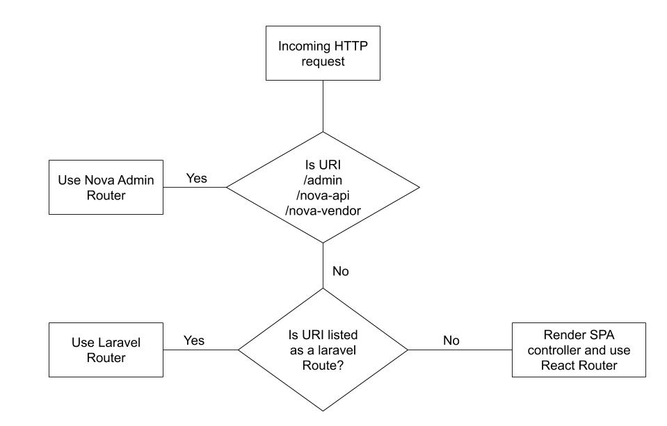

# Architecture

This scaffold is intended to work as an scalable monolith for Admin, GraphQL API and a react SPA front end app.

## Admin Panel

The admin panel is using [Laravel Nova](https://nova.laravel.com/) and it lives in the `/admin` route. The front end of the admin panel app is using Vue JS since Nova is using Vue JS. This means you should leverage the nova tools to build the admin panel.

## GraphQL API

The GraphQL API uses the following packages:

- [Lighthouse PHP](https://lighthouse-php.com/)
- [Lighthouse GraphQL Passport Auth](https://github.com/joselfonseca/lighthouse-graphql-passport-auth)
- [GraphQL PHP Scalars](https://github.com/mll-lab/graphql-php-scalars)
- [Laravel GraphQL playground](https://github.com/mll-lab/laravel-graphql-playground)

The GraphQL API is available in the route `/graphql` and the playground in `/graphql-playground`. To work on the API please make sure to visit the [Lighthouse package documentation](https://lighthouse-php.com/4.3/getting-started/installation.html) and use the most you can from the directives section before creating a custom resolver.

## Hosted React SPA

### Router

The front end application is inteded to use React with a redux store and sagas side effect. The Laravel app is serving a wildcard route that then react router is able to execute. Please see the following diagram for a better understanding of the application routing.



Any request that is not registered in the Laravel app routes will be taken to the SPA Controller and react router will take it from there.

### Authentication and Token management

One of the benefits of using this architecture is that the authentication in the React SPA application is not really handled by react but by Laravel itself using encrypted, secure HTTP only cookies. As long as the session is active in the server the react application will be able to make the queries and mutations without having to worry about token management. To accomplish this we have implemented this method from Laravel Passport [https://laravel.com/docs/6.x/passport#consuming-your-api-with-javascript](https://laravel.com/docs/6.x/passport#consuming-your-api-with-javascript).

The configuration on the apollo client allows the request to send the `X-CSRF-TOKEN` which is used to validate the session server side and act accordingly, if the session is expired, the error hanlder in the apollo client will redirect the user to `/login` where the user will be able to log back in using Laravel's authentication system. This is applied to every request made from the apollo client which means that any query or mutation validates the login server side and handles the error if the session is expired.

### Login for Mobile Apps

The above method applies to the React SPA hosted in the laravel application, for mobile applications we still need to manage the tokens locally and the mutations for login, registration and refresh token are available in the scaffold.

```graphql
type Mutation {
    login(input: LoginInput @spread): AuthPayload! @field(resolver: "Joselfonseca\\LighthouseGraphQLPassport\\GraphQL\\Mutations\\MerchantLogin@resolve")
    refreshToken(input: RefreshTokenInput @spread): RefreshTokenPayload! @field(resolver: "Joselfonseca\\LighthouseGraphQLPassport\\GraphQL\\Mutations\\RefreshToken@resolve")
    logout: LogoutResponse! @field(resolver: "Joselfonseca\\LighthouseGraphQLPassport\\GraphQL\\Mutations\\Logout@resolve")
    forgotPassword(input: ForgotPasswordInput! @spread): ForgotPasswordResponse! @field(resolver: "Joselfonseca\\LighthouseGraphQLPassport\\GraphQL\\Mutations\\ForgotPassword@resolve")
    updateForgottenPassword(input: NewPasswordWithCodeInput @spread): ForgotPasswordResponse! @field(resolver: "Joselfonseca\\LighthouseGraphQLPassport\\GraphQL\\Mutations\\ResetPassword@resolve")
    register(input: RegisterInput @spread): AuthPayload!
}
```

To make a request where the user needs to be authenticated, the GraphQL API expects the Authorization header to be send with the bearer token like this:

```
Authorization: Bearer TOKEN_HERE
```